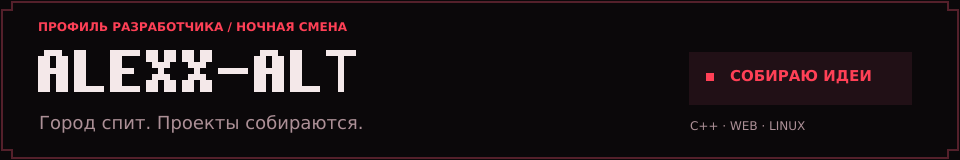
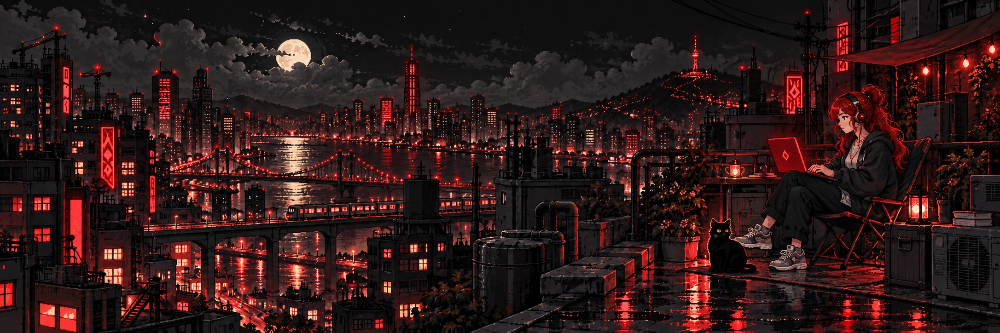
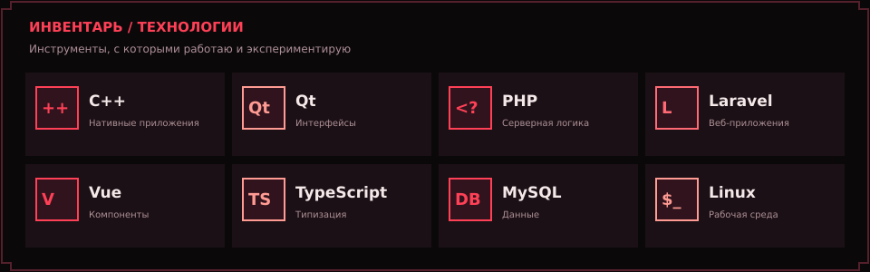
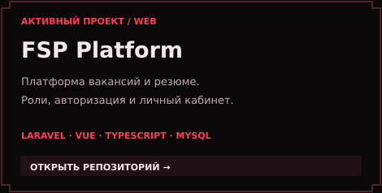
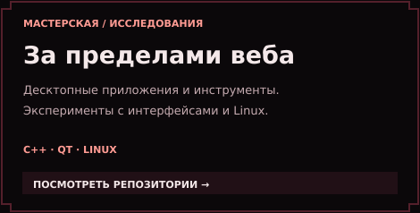
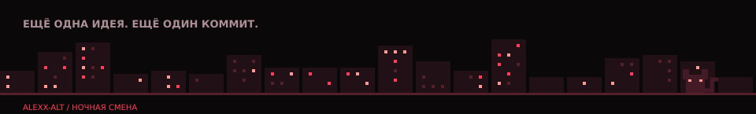

**Десктоп · Веб · Инструменты · Эксперименты**

[ПРОЕКТЫ](#-журнал-заданий) &nbsp; / &nbsp; [ИНВЕНТАРЬ](#-инвентарь) &nbsp; / &nbsp; [РЕПОЗИТОРИИ](https://github.com/Alexx-Alt?tab=repositories)

### 💬 Окно диалога

Привет, я **Alexx-Alt**. Делаю приложения, собираю инструменты и разбираюсь, как всё устроено.

Работаю с **C++ и Qt**, пишу веб-приложения на **Laravel и Vue**, использую **MySQL** и экспериментирую с **Linux**. Мне нравится, когда у проекта есть и полезный функционал, и свой характер.

> «Из идеи — в код. Из кода — в работающую штуку».

### 🎒 Инвентарь

Текстовая версия инвентаря

| Направление | Инструменты |
| --- | --- |
| Десктопные приложения | C++, Qt |
| Серверная часть | PHP, Laravel |
| Веб-интерфейсы | Vue, TypeScript |
| Данные и окружение | MySQL, Linux |

### 📜 Журнал заданий

<table>
<tr>
<td width="50%" valign="top">

</td>
<td width="50%" valign="top">

</td>
</tr>
</table>

**Текущее задание:** развиваю [FSP Platform](https://github.com/Alexx-Alt/FSP) — от реестра вакансий и резюме до личных кабинетов и инструментов поиска.

### 🌙 За кадром

- Собираю интерфейсы, с которыми приятно работать.
- Изучаю технологии через собственные проекты.
- Люблю пиксельную графику и приложения с характером.

Сохранение прогресса: каждый коммит.

